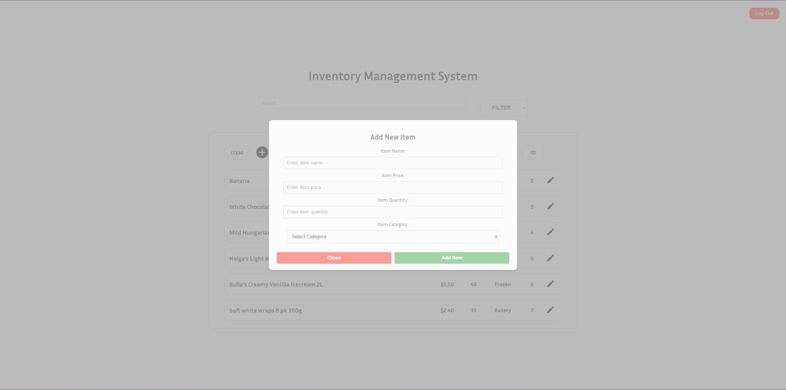

# Inventory Management System - Front End

Developed by Hayden and Kate.

Hosted on Netlify: inventorymanagementsystem.au

#### Notice:

**Please be aware** that on mobile devices, you are not able to **add**, **edit** or **remove** items. This is a feature supported by only desktop users.

Please also make sure to be aware of the server/back-end start up time when initially loading onto the website

### Initialising/Dependencies/DevDependencies for the Front-End installed:

- Node.js:
    - ```npm init -y```
- React and related packages:
    - ```npm install axios cra-template react react-dom react-router-dom react-scripts```
- Babel:
    - ```npm install @babel/core @babel/preset-env @babel/preset-react```
- Babel Plugins:
    - ```npm install @babel/plugin-proposal-private-property-in-object @babel/plugin-transform-private-property-in-object```
- Testing:
    - ```npm install @testing-library/jest-dom @testing-library/react babel-jest identity-obj-proxy jest```
    - For testing, **make sure** to add ```"type": "module"``` to the package.json file and **make sure** to **remove** it once testing is complete.

### Setting up Environment:

Once everything is installed, **make sure** to:

- Add ```"proxy": "http://localhost:3000"``` to the package.json file. Make sure the port you are using is correct.
- Create a .env file in the root of the folder and add ```REACT_APP_API_URL=https://ims-backend-2qfp.onrender.com``` for the back-end/server to work.

### Front-End Testing:


### Pages:
##### Main Page

##### Main Page - Edit Item

##### Main Page - Add Item

##### Login Page

##### Sign-Up Page


